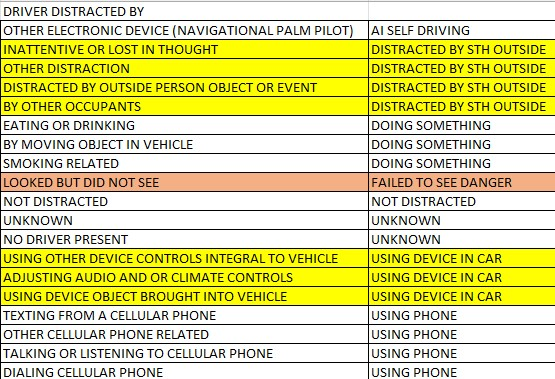

```{r setup, include=FALSE}
knitr::opts_chunk$set(echo = TRUE)
```

## Introduction: Crash Reporting in Montgomery County, Maryland (2015-2023)

 * The analysis of traffic collision data is crucial for understanding the dynamics of road safety and implementing effective measures to reduce accidents and their associated impacts. In this report, I use the "Crash Report Drivers Data of Montgomery County, Maryland" data set. This report try to reveal the key factors driving on these accidents and proposing actionable recommendations to mitigate their occurrence and impacts.
 
 * The "Crash Report Drivers Data of Montgomery County, Maryland" data set provides a detailed overview of traffic collisions involving motor vehicle operators throughout the county. The data has been collected by the Automated Crash Reporting System (ACRS) managed by the Maryland State Police and reported by multiple law enforcement agencies.  Available for **download** at   <https://catalog.data.gov/dataset/crash-reporting-drivers-data>


## Exploring Data set 
```{r echo= TRUE , warning=FALSE, message=FALSE}
# Load tidyverse, dplyr to manipulate data
# Load lubridate to manipulate dates
# Load ggplot2 for graphing

library(dplyr, warn.conflicts = F)
library(tidyverse, warn.conflicts = F)
library(lubridate, warn.conflicts = F)
library(ggplot2, warn.conflicts = F)
data = read.csv("Crash_Reporting.csv", stringsAsFactors = FALSE)
glimpse(data)

```


  * Important features:
    * **ACRS.Report.Type** : Fatal Crash, Injury Crash, Property Damage Crash
    * **Crash.Date.Time & Light** : date time and light condition
    * **Route.Type, Cross.Street.Type, Traffic Control** : specific location and traffic control
    * **Weather & Surface Condition** : Clear, Cloudy, Raining, Snow...
    * **Collision Type ** : Angle, Head-on, Rear-end, Sideswipe...
    * **Driver Substance Abuse** : Alcohol, Medication, Illegal Drug
    * **Injury Severity** :The severity of injury
    * **Circumstance** (140746/172105 fields has N/A data)
    * **Driver Distracted By** : phone activity or other distract (many categories, have to grouping or aggregating categories)

## What's interesting in that data set:

  * This data set has a lot of information, When looking at this, we can uncover the trends and relationships between various factors that contribute to collisions. The exploration can provide crucial insights for improving road safety within Montgomery County.

  * Some features have a lot of categories, some features have a lot of N/A information, also these collision reports are based on preliminary information, so information may include verified and unverified collision data, information may include mechanical or human error.
  
  * Feature has a lot of category, some category has the same meaning. Some category data is free input by law enforcement agencies so they are different name but same meaning. It need to consolidate.

## Question to answer

### Identify Trends:
  * Look for patterns related to the date. Are there more crashes during specific times of the year (e.g., winter, night times)?
  * Correlate weather data with crashes. Does rain, snow, or fog increase the frequency of accidents?
  * Find out the correlation between Traffic Control and Violations: 
  * Surface Condition: Identify if poor road conditions (wet, icy, potholes) are linked to crashes.
  
###   Driver Behavior:
  * Distraction Analysis: Understand how different types of distractions (phone use, eating, etc.) affect crash risk.
  * Impaired Driving: See if the data suggests a correlation between crashes and factors like driving under the influence of alcohol or drugs.
  * Distracted driving vs. drunk driving — which is more dangerous?


## Prepocessing Data

 * I'd like to verify whether the data is distributed evenly throughout the entire year. I'll conduct the analysis on the data covering the entire year.
 * Fully years is from 2015 to 2023

```{r}

tmp_data <- data %>%
  mutate(Crash.Date.Time = mdy_hms(Crash.Date.Time)) %>%
  group_by(Year = year(Crash.Date.Time)) %>%
  summarise(Count = n_distinct(as.Date(Crash.Date.Time)))

fully_filled_years <- tmp_data$Year[tmp_data$Count == 365 | tmp_data$Count == 366]
partially_filled_years <- tmp_data$Year[!(tmp_data$Year %in% fully_filled_years)]

print(paste("Fully filled years:", paste(fully_filled_years, collapse = ", ")))
print(paste("Partially filled years:", paste(partially_filled_years, collapse = ", ")))

```

## When are the most dangerous times to be driving

```{r, echo= FALSE , results='hide', warning=FALSE, message=FALSE}

data = read.csv("Crash_Reporting.csv")
data$Crash_Date <- as.POSIXct(data$Crash.Date.Time, format = "%m/%d/%Y %I:%M:%S %p")
  
data$month <- month(data$Crash_Date)
data$year <- year(data$Crash_Date)
data$wday <- wday(data$Crash_Date)
data$hour <- hour(data$Crash_Date)

cleaned_data <- data
  
  # Define peak hours
peak_start <- 15
peak_end <- 17
  
dayHour_data <- data %>% 
    group_by(hour, wday) %>% 
    summarise(N = n())

  dayHour_data %>% 
    ggplot(aes(x = hour, y = N, color = factor(wday))) + 
    geom_line() +
    geom_vline(xintercept = peak_start, color = "red", linetype = "dashed") +  
    geom_vline(xintercept = peak_end, color = "red", linetype = "dashed") + 
    labs(title = "Number of Cases Accident by Time", x = "Hour", y = "Number of Cases", color = "") +
    scale_color_manual(values = c("1" = "red", "2"= "blue", "3"="green", "4"="orange", "5"="purple", "6"="brown", "7"="black"),
                       labels=c("Sunday", "Monday", "Tuesday", "Wednesday", "Thursday", "Friday", "Saturday"))
```

* According to the graph, the most dangerous time to drive is on **Monday - Friday** between **3:00 PM and 5:00 PM**, when the number of car accidents is highest. There is a secondary peak in car accidents around **8:00 AM**. It is generally **safer to drive early in the morning or later at night**.

---

### 

* An alternative perspective on examining the frequency of traffic accidents by hour on weekdays is by observing a heatmap, which yields comparable findings to the previously analyzed chart.

```{r, echo= FALSE , results='hide', warning=FALSE, message=FALSE}

dayHour_data <- data %>% group_by(hour, wday) %>% dplyr::summarise(N = n())

ggplot(dayHour_data, aes(hour, wday)) + 
  geom_tile(aes(fill = N),colour = "white", na.rm = TRUE) +
  scale_fill_gradient(low = "#d8e1cf", high = "#ff0000", na.value = "grey90", limits = c(0, max(dayHour_data$N))) +
  guides(fill=guide_legend(title="Total Incidents")) +
  theme_bw() + 
  labs(title = "Montgomery Incidents Heatmap: Day of Week and Hour Analysis",
       x = "Incidents Per Hour", y = "Day of Week") +
  theme(panel.grid.major = element_blank(), panel.grid.minor = element_blank()) ## create a cleaner visual
```

* Drawing from everyday life observations, individuals typically go to work or school around 8:00 a.m. and begin go back home between 3:00 p.m. to 5:00 p.m. Consequently, more vehicle are on road, which increased collision rates.


## Distribution Of Accident 2015 - 2023

* The next thing I want to look for is **seasonal pattern**. I then examined whether there was a seasonal trend. When I organized the incidents by date and plotted them (see graph below), I noticed that although there's a bit more variation during winter, the overall rate remains fairly consistent throughout the year.
* It's important to note that during the COVID-19 pandemic year, the accident data is notably lower. Given the context of the COVID-19 pandemic, with **more people staying home**, there's a corresponding **decrease in vehicle traffic** on the streets, consequently leading to **fewer accidents**.

```{r, echo= FALSE , results='hide', warning=FALSE, message=FALSE}

cleaned_data$Crash.Date.Time <- as.POSIXct(cleaned_data$Crash.Date.Time, format = "%m/%d/%Y %I:%M:%S %p")

accident_count <- cleaned_data %>%
  mutate(Date = as.Date(Crash.Date.Time),
         Year = lubridate::year(Crash.Date.Time)) %>% 
  group_by(Year, Date) %>%
  summarise(Count = n()) %>%
  ungroup()

stats_per_year <- accident_count %>%
  group_by(Year) %>%
  summarise(Mean = mean(Count), SD = sd(Count))

# Add a column for threshold mean + 2 standard deviation
stats_per_year <- stats_per_year %>%
  mutate(Threshold = Mean + 2 * SD)

accident_count <- accident_count %>%
  left_join(stats_per_year, by = "Year")

accident_count <- accident_count %>%
  filter(Year != 2024)

ggplot(accident_count, aes(x = Date, y = Count, color = Count > Threshold)) +
  geom_point(shape = "x", size = 3) +  
  geom_hline(aes(yintercept = Mean), color = "blue", linetype = "dashed", size = 1) +
  labs(title = "Accident Count Over Time",
       x = "Date", y = "Accident Count", color = "") +
  scale_color_manual(values = c("FALSE" = "grey40", "TRUE" = "red"),
                     labels = c("Below 2 Standard Deviation From Mean", "Above 2 Standard Deviation From Mean")) +
  scale_x_date(date_labels = "%b", date_breaks = "2 month") + 
  theme_minimal() +
 facet_wrap(~ Year, scales = "free_x")

```

* One point of interest is in late December. These are the three days of the year with the **lowest** number of crashes: **Christmas Day, Boxing Day, and New Year’s Eve**.

## Accident Severity by Year

```{r, echo= FALSE , results='hide', warning=FALSE, message=FALSE}

cleaned_data$Crash_Date <- as.POSIXct(data$Crash.Date.Time, format = "%m/%d/%Y %I:%M:%S %p")
cleaned_data$month <- month(data$Crash_Date)
cleaned_data$year <- year(data$Crash_Date)
cleaned_data$wday <- wday(data$Crash_Date)
cleaned_data$hour <- hour(data$Crash_Date)

filtered_data <- cleaned_data %>%
  filter(year != 2024)

agg_data <- filtered_data %>%
  group_by(year, ACRS.Report.Type) %>%
  summarise(Count = n())

ggplot(agg_data, aes(x = factor(year), y = Count, fill = ACRS.Report.Type)) +
  geom_bar(stat = "identity", position = position_dodge(width = 0.8)) +
  labs(x = "Year", y = "No. Of Accidents", fill = "Accident Severity") +
  theme_minimal() +
  theme(axis.text.x = element_text(angle = 45, hjust = 1))
```

* The total number of traffic accidents declined during the COVID-19 period. Subsequently, post-COVID, there was an uptick in accidents, accompanied by a steady rise in injury rates.
* The incidence of traffic accidents resulting in injuries remains consistently uniform each year, comprising one-third of all reported traffic accidents.

## Weather Condition

```{r, echo= FALSE , results='hide', warning=FALSE, message=FALSE}

library(ggrepel)

weather_counts <- table(cleaned_data$Weather)
weather_data <- data.frame(Weather = names(weather_counts), Count = as.vector(weather_counts))
weather_data <- weather_data[weather_data$Weather != "N/A", ]
weather_data <- weather_data[order(-weather_data$Count), ]
weather_data$Percentage <- with(weather_data, round(Count / sum(Count) * 100, 2))
top_4_names <- head(weather_data$Weather, 4)

top_4_weather <- cleaned_data %>%
  filter(Weather %in% top_4_names)

top_4_weather_summary <- top_4_weather %>%
  group_by(Weather, ACRS.Report.Type) %>%
  summarise(Count = n()) %>%
  mutate(Percentage = Count / sum(Count) * 100)


ggplot(top_4_weather_summary, aes(x = Weather, y = Count, fill = ACRS.Report.Type)) +
  geom_bar(stat = "identity") +
  labs(title = "Top 4 Weather Conditions", x = "Weather", y = "No.Of.Accidents", fill ="Accident Severity") +
  theme_minimal() +
  theme(axis.text.x = element_text(angle = 45, hjust = 1)) +
  # repelled label
  geom_text_repel(aes(label = paste0(round(Percentage, 1), "%")), position = position_stack(vjust = 0.5))

```


* The majority of accidents occurred under clear weather condition, while rainy and cloudy condition contribute almost the same proportion. A minimal accident proportion were record during snow condition. In each type of weather the proportion of accident severity is the same which is 36% to 39% of accident involved in injury.

## Surface Conditions

```{r, echo= FALSE , results='hide', warning=FALSE, message=FALSE}

surface_counts <- table(cleaned_data$Surface.Condition)
surface_data <- data.frame(surface = names(surface_counts), Count = as.vector(surface_counts))
surface_data <- surface_data[surface_data$surface != "N/A", ]
surface_data <- surface_data[order(-surface_data$Count), ]
surface_data$Percentage <- with(surface_data, round(Count / sum(Count) * 100, 2))
top_3_surface <- head(surface_data$surface, 2)

top_3_surface <- cleaned_data %>%
  filter(Surface.Condition %in% top_3_surface)

top_3_surface_summary <- top_3_surface %>%
  group_by(Surface.Condition, ACRS.Report.Type) %>%
  summarise(Count = n()) %>%
  mutate(Percentage = Count / sum(Count) * 100)

ggplot(top_3_surface_summary, aes(x = Surface.Condition, y = Count, fill = ACRS.Report.Type)) +
  geom_bar(stat = "identity") +
  labs(title = "Top 2 Surface Conditions", x = "Surface", y = "No.Of.Accidents", fill ="Accident Severity") +
  theme_minimal() +
  theme(axis.text.x = element_text(angle = 45, hjust = 1)) +
  # Add repelled percentage labels
  geom_text_repel(aes(label = paste0(round(Percentage, 1), "%")), position = position_stack(vjust = 0.5))

```

* The majority 78.7% of accidents happened on dry surfaces while Wet surfaces accounted for  totaling around 19.5% of accidents. 38% of accident involved injury in each surface condition.


## Light Condition

```{r, echo= FALSE , results='hide', warning=FALSE, message=FALSE}

cleaned_data <- data %>% 
  filter(!is.na(Light) & Light != "" & Light != "N/A" & Light != "UNKNOWN")

cleaned_data$Light <- case_when(
  grepl("DARK", cleaned_data$Light) ~ "DARK",
  cleaned_data$Light %in% c("DUSK", "DAWN") ~ "WEAK LIGHT",
  TRUE ~ cleaned_data$Light
)

light_counts <- table(cleaned_data$Light)
light_data <- data.frame(Light = names(light_counts), Count = as.vector(light_counts))

light_data <- light_data[!(light_data$Light %in% c("N/A", "OTHER")), ]

light_data <- light_data[order(-light_data$Count), ]

light_data$Percentage <- with(light_data, round(Count / sum(Count) * 100, 2))

top_4_names <- head(light_data$Light, 4)

ggplot(light_data, aes(x = "", y = Count, fill = Light)) +
  geom_bar(stat = "identity", width = 1) +
  coord_polar("y", start = 0) +
  theme_void() +
  theme(legend.position = "right") +
  labs(title = "Light Condition") +
  geom_text(data = subset(light_data, Light %in% top_4_names),
            aes(label = paste(Light, "\n", Percentage, "%", sep = "")),
            position = position_stack(vjust = 0.5),
            size = 3) +
  scale_fill_brewer(palette = "Set3")
```

* The pie chart outlines accident distribution by light conditions. Around 68.46% of incidents occurred during daylight, while dark conditions contributed to 27.17% of accidents. Weak light conditions accounted for a smaller proportion, approximately 4.37%, of incidents. This breakdown highlights the dominance of accidents during daylight hours, with a significant portion also happening in the dark, and a lesser occurrence under weak light conditions.


## Traffic Control

```{r, echo= FALSE , results='hide', warning=FALSE, message=FALSE}

cleaned_data <- data %>% 
  filter(!is.na(Traffic.Control) & Traffic.Control != "" & Traffic.Control != "N/A" & Traffic.Control != "UNKNOWN")

traffic_control_counts <- table(cleaned_data$Traffic.Control)
traffic_control_data <- data.frame(Traffic_Control = names(traffic_control_counts), Count = as.vector(traffic_control_counts))

traffic_control_data <- traffic_control_data[!(traffic_control_data$Traffic_Control %in% c("N/A", "OTHER")), ]

traffic_control_data <- traffic_control_data[order(-traffic_control_data$Count), ]

traffic_control_data$Percentage <- with(traffic_control_data, round(Count / sum(Count) * 100, 2))

top_4_names <- head(traffic_control_data$Traffic_Control, 4)

ggplot(traffic_control_data, aes(x = "", y = Count, fill = Traffic_Control)) +
  geom_bar(stat = "identity", width = 1) +
  coord_polar("y", start = 0) +
  theme_void() +
  theme(legend.position = "right") +
  labs(title = "Percentage of Accident by Traffic Control") +
  geom_text(data = subset(traffic_control_data, Traffic_Control %in% top_4_names),
            aes(label = paste(Traffic_Control, "\n", Percentage, "%", sep = "")),
            position = position_stack(vjust = 0.5),
            size = 3) +
  scale_fill_brewer(palette = "Set3")

```

* The pie chart illustrates accident distribution concerning traffic control measures. The majority, comprising 47.54% of incidents, occurred in areas with no traffic control. Accidents at traffic signals accounted for 40.79% of incidents, while those at stop signs constituted 8.65%. A smaller proportion, approximately 1.48%, of accidents occurred at locations with flashing traffic signals. This breakdown emphasizes the prevalence of accidents in areas lacking traffic control, followed by those regulated by traffic signals and stop signs, with fewer incidents occurring at locations with flashing traffic signals.


## Driver Behaviours - Distraction Analyst


```{r, echo= FALSE , results='hide', warning=FALSE, message=FALSE}

# Function to normalize data
normalize_distracted_by <- function(distracted_by) {
  normalized_type <- switch(distracted_by,
"DIALING CELLULAR PHONE" = "USING PHONE",
"TALKING OR LISTENING TO CELLULAR PHONE" = "USING PHONE",
"OTHER CELLULAR PHONE RELATED" = "USING PHONE",
"TEXTING FROM A CELLULAR PHONE" = "USING PHONE",
"USING DEVICE OBJECT BROUGHT INTO VEHICLE" = "USING DEVICE IN CAR",
"ADJUSTING AUDIO AND OR CLIMATE CONTROLS" = "USING DEVICE IN CAR",
"USING OTHER DEVICE CONTROLS INTEGRAL TO VEHICLE" = "USING DEVICE IN CAR",
"NO DRIVER PRESENT" = "UNKNOWN",
"UNKNOWN" = "UNKNOWN",
"NOT DISTRACTED" = "NOT DISTRACTED",
"LOOKED BUT DID NOT SEE" = "FAILED TO SEE DANGER",
"SMOKING RELATED" = "DOING SOMETHING",
"BY MOVING OBJECT IN VEHICLE" = "DOING SOMETHING",
"EATING OR DRINKING" = "DOING SOMETHING",
"BY OTHER OCCUPANTS" = "DISTRACTED BY STH OUTSIDE",
"DISTRACTED BY OUTSIDE PERSON OBJECT OR EVENT" = "DISTRACTED BY STH OUTSIDE",
"OTHER DISTRACTION" = "DISTRACTED BY STH OUTSIDE",
"OTHER ELECTRONIC DEVICE (NAVIGATIONAL PALM PILOT)" = "AI SELF DRIVING",
"INATTENTIVE OR LOST IN THOUGHT" = "DISTRACTED BY STH OUTSIDE",
    NULL  # Default case (for unexpected values)
  )
  return(normalized_type)
}

cleaned_data$Normalized_Distracted_By <- sapply(cleaned_data$Driver.Distracted.By, normalize_distracted_by)

distracted_by_counts <- table(cleaned_data$Normalized_Distracted_By)
distracted_by_data <- data.frame(Normalized_Distracted_By = names(distracted_by_counts), 
                                  Count = as.vector(distracted_by_counts))


distracted_by_data <- distracted_by_data[order(-distracted_by_data$Count), ]

distracted_by_data$Percentage <- with(distracted_by_data, round(Count / sum(Count) * 100, 2))

top_names <- head(distracted_by_data$Normalized_Distracted_By, 4)

ggplot(distracted_by_data, aes(x = "", y = Count, fill = Normalized_Distracted_By)) +
  geom_bar(stat = "identity", width = 1) +
  coord_polar("y", start = 0) +
  theme_void() +
  theme(legend.position = "right") +
  labs(title = "Driver Distracted By") +
  geom_text(data = subset(distracted_by_data, Normalized_Distracted_By %in% top_names),
            aes(label = paste(Normalized_Distracted_By, "\n", Percentage, "%", sep = "")),
            position = position_stack(vjust = 0.5),
            size = 3) +
  scale_fill_brewer(palette = "Set3")


```



 * Based on data collected by law enforcement personnel, it's revealed that 12.8% of accidents result from individuals failing to assess dangerous situations adequately. Surprisingly, only a small fraction of individuals admit to using their phones during these incidents, with a majority, comprising 62%, claiming they were not distracted at the time. These findings shed light on the complexities of driver behavior and highlight potential areas for targeted road safety interventions.


## Driving Under The Influence ( Alcohol, Drug)

```{r, echo= FALSE , results='hide', warning=FALSE, message=FALSE}

# Function to normalize data
normalize_substance_abuse <- function(substance_abuse) {
  normalized_substance <- switch(substance_abuse,
    "NONE DETECTED" = "NOT DETECTED",
    "N/A" = "UNKNOWN",
    "UNKNOWN" = "UNKNOWN",
    "ALCOHOL PRESENT" = "ALCOHOL",
    "COMBINED SUBSTANCE PRESENT" = "COMBINATION",
    "ILLEGAL DRUG PRESENT" = "DRUG",
    "ALCOHOL CONTRIBUTED" = "ALCOHOL",
    "ILLEGAL DRUG CONTRIBUTED" = "DRUG",
    "MEDICATION CONTRIBUTED" = "MEDICATION",
    "MEDICATION PRESENT" = "MEDICATION",
    "COMBINATION CONTRIBUTED" = "COMBINATION",
    "OTHER" = "OTHER",
    "NULL"  # Default case (for unexpected values)
  )
  return(normalized_substance)
}

cleaned_data$Normalized_Substance_Abuse <- sapply(cleaned_data$Driver.Substance.Abuse, normalize_substance_abuse)

cleaned_data <- cleaned_data %>% filter(Normalized_Substance_Abuse !="UNKNOWN" & Normalized_Substance_Abuse !="OTHER")

substance_abuse_counts <- table(cleaned_data$Normalized_Substance_Abuse)
substance_abuse_data <- data.frame(Normalized_Substance_Abuse = names(substance_abuse_counts), 
                                  Count = as.vector(substance_abuse_counts))

substance_abuse_data <- substance_abuse_data[order(-substance_abuse_data$Count), ]
substance_abuse_data$Percentage <- with(substance_abuse_data, round(Count / sum(Count) * 100, 2))

ggplot(substance_abuse_data, aes(x = Normalized_Substance_Abuse, y = Count, fill = Normalized_Substance_Abuse)) +
  geom_bar(stat = "identity") +
  labs(title = "",
       x = "Influence",
       y = "No.Of Accidents", fill = "") +
  geom_text(aes(label = paste0(Percentage, "%")), vjust = -0.5, size = 3) +
  scale_fill_brewer(palette = "Set3") +
  theme_minimal()


```

* Approximately 4% of accidents are attributed to drivers under the influence of alcohol.
## Distracted Driving vs Drunk Driving. Which one cause more accident ?

```{r, echo= FALSE , results='hide', warning=FALSE, message=FALSE}

filtered_data <- distracted_by_data %>%
  filter(!(Normalized_Distracted_By %in% c("UNKNOWN", "NOT DISTRACTED")))

total_count <- sum(filtered_data$Count)

filtered_substance_data <- substance_abuse_data %>%
  filter(!(Normalized_Substance_Abuse %in% c("REMOVE", "UNKNOWN")))

total_substance_count <- sum(filtered_substance_data$Count)

library(ggplot2)

summary_data <- data.frame(Factor = c("Driver Distracted", "Driver Using Alcohol/Drug"),
                              Total_Count = c(total_count, total_substance_count))

ggplot(summary_data, aes(x = Factor, y = Total_Count, fill = Factor)) +
  geom_bar(stat = "identity") +
  labs(title = "Distracted driving vs. drunk driving",
       x = "Factor",
       y = "No.Of.Accident", fill ="") +
  theme_minimal()


```

* Base on the data, distracted driving poses a significantly higher risk of accidents compared to drunk driving. While both behaviors contribute to road safety concerns, the prevalence of distractions such as phone use, eating, or adjusting controls has escalated with the widespread adoption of technology and multitasking habits.
* However, the pervasive nature of distractions in modern life underscores the urgent need for continued education and enforcement efforts to curb this alarming trend and ensure safer roads for all.

## Location of Fatal Accidents

```{r, echo= FALSE , results='asis', warning=FALSE, message=FALSE}

library(leaflet)

fatal <- data %>% 
  filter(ACRS.Report.Type == "Fatal Crash")
   
m <- leaflet(fatal) %>%
  addTiles() %>%
  setView(lng = mean(fatal$Longitude), lat = mean(fatal$Latitude), zoom = 10) # Set initial view to center around the data

m <- m %>%
  addCircleMarkers(~Longitude, ~Latitude, color = "red",
                   fillColor = ~Injury.Severity, fillOpacity = 0.6, radius = 2)

m

```

* Fatal accidents can occur in various locations, but they are more prevalent on streets with dense population.


## Conclusions

* Most dangerous time to drive: most accidents occur during "rush hour," between 3 p.m. and 5 p.m
* There are more accident happened at Traffic Signal. 
* Major accident happened at Daylight, Clear Weather, Dry Surface Road and in Medium Speed Limit Zone.
* 2/3 of confessed that they were doing something that lead to accident
* Distracted driving caused more accident than Drunk driving.


## 


